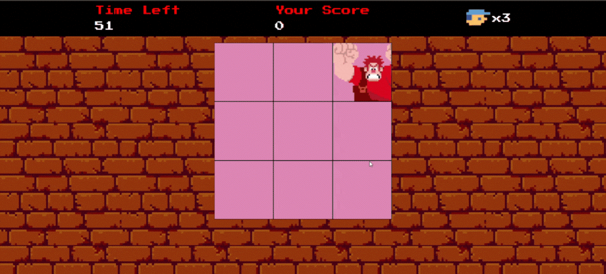

# 🎮 Detona Ralph - Mini Jogo

Bem-vindo ao **Detona Ralph**, um mini jogo desenvolvido durante o curso de **Desenvolvimento Front-End da DIO**. Neste jogo divertido e viciante, seu objetivo é **acertar o Ralph** sempre que ele aparecer na tela e acumular a maior pontuação possível antes que o tempo acabe! ⏰

---

## 📸 Demonstração

 <!-- Substitua por um gif ou imagem real do seu jogo rodando -->

---

## 🕹️ Como jogar

1. Assim que o jogo começar, o Ralph aparecerá aleatoriamente em diferentes quadrados da tela.
2. Clique nele o mais rápido possível para **ganhar pontos**.
3. Você tem **60 segundos** para marcar o máximo de pontos que conseguir.
4. Quando o tempo acabar, o jogo exibirá sua pontuação final.

---

## 🚀 Tecnologias utilizadas

- HTML5
- CSS3
- JavaScript 

---

## 📁 Estrutura do Projeto
```
📦 Detona-Ralph
├── index.html
├── README.md
└── src
    └── images
        └── favicon.jpg
        └── player.png
        └── ralph.png
        └── wall.png
    └── scripts
        └── engine.js
    └── sounds
        └── hit.m4a
    └── styles
        └── main.css
        └── reset.css
```

---

## 🔧 Funcionalidades principais

- Ralph aparece de forma **aleatória** a cada segundo.
- Sistema de **pontuação** dinâmico.
- Temporizador regressivo de **60 segundos**.
- **Feedback sonoro** ao acertar o Ralph.
- Alert final com a sua **pontuação**.

---

## 📦 Como executar o projeto

1. Clone o repositório:
   ```bash
   git clone https://github.com/GeovannaCassia/Game-Detona-Ralph.git

2. Acesse a pasta do projeto:
    ```bash
    cd Game-Detona-Ralph
3. Abra o arquivo `index.html` em seu navegador.

## 📚 Aprendizados
Este projeto foi uma excelente oportunidade para aplicar e consolidar conhecimentos em:

* Manipulação do DOM com JavaScript.

* Eventos e interações com o usuário.

* Lógica de jogo simples.

* Animações e sons para melhorar a experiência do usuário.

## 🙌 Agradecimentos
Projeto desenvolvido como parte do curso de Desenvolvimento Front-End da Digital Innovation One (DIO). Agradeço à plataforma pelos conteúdos gratuitos e didáticos!


